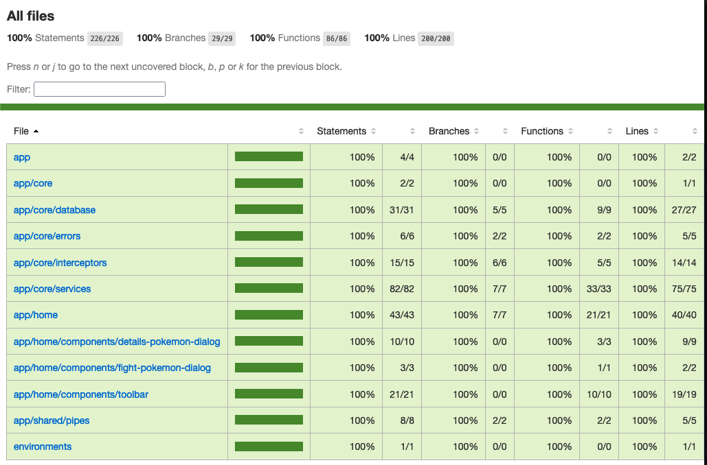
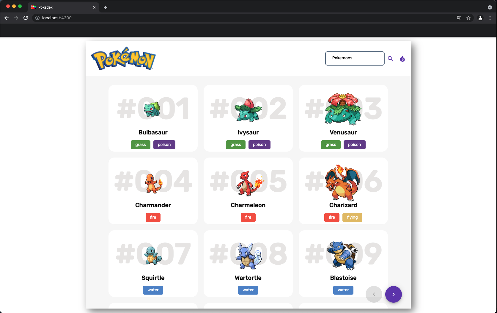
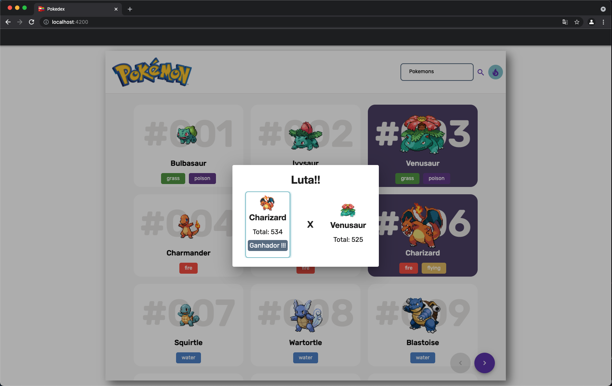

<div id="top"></div>


[![Gmail][gmail-shield]][gmail-url]
[![MIT License][license-shield]][license-url]
[![LinkedIn][linkedin-shield]][linkedin-url]

<!-- PROJECT LOGO -->
<br />
<div align="center">
  <a href="https://github.com/pPeterle/pokedex">
    
  </a>

  <h3 align="center">Pokedex ·  <a href="https://pokeapi.co/docs/v2"><strong>Pokeapi</strong></a> </h3>

  <p align="center">
    List of all pokemons with their status
  </p>
</div>

<!-- ABOUT THE PROJECT -->
## About The Project

This project is based on a technical interview on Aevo, what the requirements are:

- [x] Explore <a href="https://pokeapi.co/docs/v2"><strong>Pokeapi</strong></a> documentation
- [x] Create a page to show the list of pokemon
- [x] Add search input
- [x] Open details from a specific pokemon
- [x] Show the total status from the selected pokemon
- [x] Bonus:
    - [x] Setup with Angular 
    - [x] Good and interactive design
    - [x] 100% tests coverage
    - [x] Data persistencie
        - [x] Index Db
        - [x] Local Storage
    - [x] Battle Pokemon, select two pokemon and show which have the greater 
    - [x] Documentation


Folder structure:

Core: Business logic of the application, containing singleton services. <br>
Modules: Single part of UI that do one job. It can contain multiple pages and components. <br>
Shared: Elements that are shared in the application <br>

- app
  - core
    - http
    - interceptors
    - database
    - errors
    - models
    - services
  - modules
    - home
      - components
  - shared
    - pipes

### Built With

* [Typescript](https://www.typescriptlang.org/)
* [Angular](https://angular.io/)
* [Angular Material](https://material.angular.io/)
* [Bootstrap](https://getbootstrap.com)

<!-- GETTING STARTED -->
## Getting Started

### Installation

1. Clone the repo
   ```sh
   git clone https://github.com/pPeterle/pokedex.git
   ```
2. Install NPM packages
   ```sh
   npm install
   ```
3. Run the Project
   ```sh
   npm run start
   ```
### Tests

  

1. Unit Tests
   ```sh
   npm run test
   ```
2. e2e Tests
   ```sh
   npm run cypress:open
   ```

<!-- USAGE EXAMPLES -->
## Usage
<div >

</div>
<table>
  <tr>
    <td valign="top">  </td>
    <td valign="top">  </td>
  </tr>
</table>

<!-- ROADMAP -->
## Roadmap

- [x] Add Documentation
- [ ] Add types logic to the battle pokemon


<!-- LICENSE -->
## License

Distributed under the MIT License. See `LICENSE.txt` for more information.

<!-- CONTACT -->
## Contact

Pedro Henrique do Amaral Peterle - phpeterle1@gmail.com

Project Link: [https://github.com/pPeterle/pokedex](https://github.com/pPeterle/pokedex)


<!-- MARKDOWN LINKS & IMAGES -->
<!-- https://www.markdownguide.org/basic-syntax/#reference-style-links -->
[gmail-shield]: https://img.shields.io/badge/Gmail-D14836?style=for-the-badge&logo=gmail&logoColor=white
[gmail-url]: https://mail.google.com/mail/?view=cm&fs=1&to=phpeterle1@gmail.com
[license-shield]: https://img.shields.io/github/license/othneildrew/Best-README-Template.svg?style=for-the-badge
[license-url]: https://github.com/othneildrew/Best-README-Template/blob/master/LICENSE.txt
[linkedin-shield]: https://img.shields.io/badge/-LinkedIn-black.svg?style=for-the-badge&logo=linkedin&colorB=555
[linkedin-url]: https://github.com/pPeterle/pokedex/blob/main/LICENSE
[product-screenshot]: images/screenshot.png
